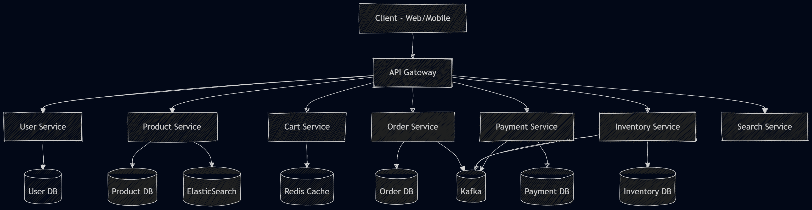

# High Level Design - E-Commerce System

---

# 1. Overview

This document describes the high-level architecture of a scalable e-commerce system similar to Amazon/Flipkart. The system is designed to handle large-scale traffic, ensure high availability, and support future scalability.

---

# 2. System Architecture

## 2.1 Architecture Style

We start with a **modular monolith** and evolve into **microservices** as the system scales.

- Early stage: Single deployable service (simpler development)
- Scale stage: Split into independent services

---

## 2.2 High-Level Architecture Diagram

---

# 3. Core Components

## 3.1 Client Layer
- Web application (React/Angular)
- Mobile application (Android/iOS)
- Communicates with backend via APIs

---

## 3.2 API Gateway
- Single entry point for all client requests
- Responsibilities:
  - Authentication
  - Request routing
  - Rate limiting
  - Logging

---

## 3.3 User Service
- Handles:
  - User authentication
  - Profile management
  - Address management

---

## 3.4 Product Service
- Manages:
  - Product catalog
  - Categories
  - Product details
- Integrates with search engine for fast querying

---

## 3.5 Cart Service
- Handles:
  - Add/remove items
  - Update quantity
- Uses cache (Redis) for fast access

---

## 3.6 Order Service
- Responsible for:
  - Order creation
  - Order history
  - Order status tracking

---

## 3.7 Payment Service
- Handles:
  - Payment processing
  - Payment status
- Integrates with external payment gateways

---

## 3.8 Inventory Service
- Tracks stock levels
- Prevents overselling
- Updates stock after order placement

---

## 3.9 Search Service
- Powered by ElasticSearch
- Enables:
  - Fast keyword search
  - Filtering and sorting

---

## 3.10 Cache Layer (Redis)
- Used for:
  - Cart data
  - Frequently accessed products
- Reduces database load

---

## 3.11 Database Layer
- Each service has its own database (in microservices architecture)
- Types:
  - Relational DB (orders, payments)
  - NoSQL DB (catalog, cart)

---

## 3.12 Message Queue (Kafka)
- Enables asynchronous communication
- Used for:
  - Order processing
  - Inventory updates
  - Notifications

---

# 4. Data Flow (Example: Order Placement)

1. User places order from client
2. Request goes to API Gateway
3. Order Service creates order
4. Inventory Service checks stock
5. Payment Service processes payment
6. Order is confirmed
7. Event is sent via Kafka
8. Inventory is updated
9. Notification is sent to user

---

# 5. Key Design Decisions

## 5.1 Microservices Architecture
- Improves scalability and maintainability
- Allows independent deployment

---

## 5.2 Database per Service
- Avoids tight coupling
- Improves fault isolation

---

## 5.3 Caching Strategy
- Redis used to reduce latency
- Frequently accessed data cached

---

## 5.4 Asynchronous Processing
- Kafka used for event-driven architecture
- Improves performance and reliability

---

## 5.5 Search Optimization
- ElasticSearch used instead of DB queries
- Enables fast and scalable search

---

# 6. Bottlenecks and Solutions

## 6.1 High Read Traffic
- Solution: Caching + CDN

## 6.2 Database Load
- Solution: Read replicas + sharding

## 6.3 Payment Failures
- Solution: Retry mechanism + idempotency

## 6.4 Inventory Conflicts
- Solution: Strong consistency + locking

---