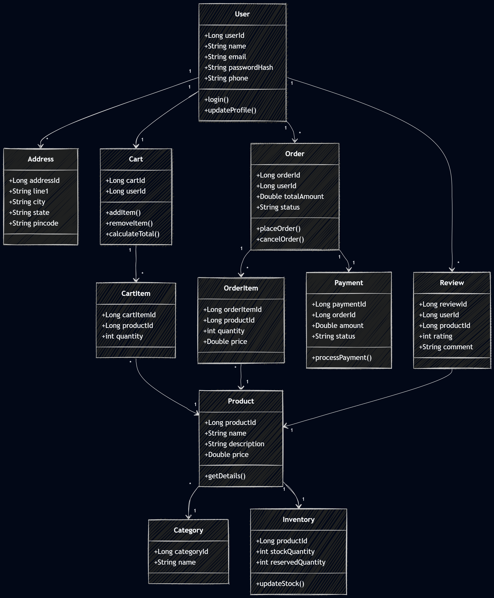

# Low Level Design - E-Commerce System

---



# 1. Overview

This document describes the detailed design of the e-commerce system, including database schema, entities, and relationships between different components.

---

# 2. Core Entities

## 2.1 User
- user_id (PK)
- name
- email (unique)
- password_hash
- phone
- created_at

---

## 2.2 Address
- address_id (PK)
- user_id (FK)
- line1
- line2
- city
- state
- pincode
- country

---

## 2.3 Product
- product_id (PK)
- name
- description
- price
- category_id (FK)
- created_at

---

## 2.4 Category
- category_id (PK)
- name
- parent_category_id (FK)

---

## 2.5 Inventory
- product_id (PK, FK)
- stock_quantity
- reserved_quantity

---

## 2.6 Cart
- cart_id (PK)
- user_id (FK)
- created_at

---

## 2.7 CartItem
- cart_item_id (PK)
- cart_id (FK)
- product_id (FK)
- quantity

---

## 2.8 Order
- order_id (PK)
- user_id (FK)
- total_amount
- status
- created_at

---

## 2.9 OrderItem
- order_item_id (PK)
- order_id (FK)
- product_id (FK)
- quantity
- price

---

## 2.10 Payment
- payment_id (PK)
- order_id (FK)
- amount
- status
- payment_method
- transaction_id

---

## 2.11 Review
- review_id (PK)
- user_id (FK)
- product_id (FK)
- rating
- comment
- created_at

---

# 3. Relationships

- One User → Many Addresses
- One User → One Cart
- One Cart → Many CartItems
- One Product → One Inventory
- One Order → Many OrderItems
- One User → Many Orders
- One Product → Many Reviews
- One Category → Many Products

---

# 4. Database Schema (Relational)

## 4.1 Users Table
```sql
CREATE TABLE users (
    user_id BIGINT PRIMARY KEY,
    name VARCHAR(255),
    email VARCHAR(255) UNIQUE,
    password_hash TEXT,
    phone VARCHAR(20),
    created_at TIMESTAMP
);